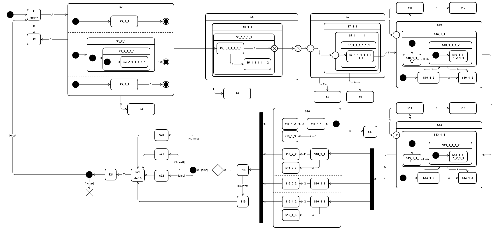

# statemachine demonstration with the Qt framework
This is a open source demonstration of a complex statemachine called "42" with the qt framework.

# requirements
* pyQT5

# Howto use
Start the program with:
$ python fourty_two.py

An empty window will popup. Press the keys you find in the image 42.png in order to switch states.
I.e. press "A" in order to go to from state S1 to state S3.

# Image source
The image from the documenatation of the statemachine framework "yasmine" from the company seadex.
The license of yasmine is included in the folder of the image.

http://yasmine.seadex.de/Forty_two_(42).html

# Purpose
This project is for educational purposes.